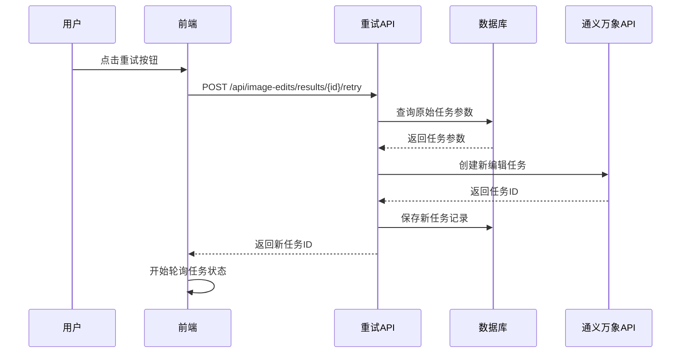

# 重试功能实现文档

## 概述

重试功能允许用户使用相同的参数重新生成失败或不满意的图片。系统会保存原始任务的所有参数，重试时从数据库获取这些参数创建新任务。

## 数据库设计

### 新增字段

在 `image_edit_tasks` 表中添加了 `scale_factor` 字段：

```sql
ALTER TABLE "image_edit_tasks" 
ADD COLUMN "scale_factor" integer;
```

### 保存的参数

每个任务保存以下参数用于重试：

- `edit_function`: 编辑功能类型
- `prompt`: 提示词
- `original_image_url`: 原始图片URL
- `mask_image_url`: 蒙版图片URL（可选）
- `image_count`: 生成图片数量
- `strength`: 编辑强度
- `scale_factor`: 图像超分放大倍数

## API接口

### 1. 通过任务ID重试

**POST** `/api/image-edits/[taskId]/retry`

根据任务ID获取原始参数并创建新任务。

响应：

```json
{
  "success": true,
  "data": {
    "taskId": "新任务ID",
    "status": "pending"
  }
}
```

### 2. 通过结果ID重试

**POST** `/api/image-edits/results/[resultId]/retry`

根据结果ID获取原始任务参数并创建新任务。

响应：

```json
{
  "success": true,
  "data": {
    "taskId": "新任务ID", 
    "status": "pending"
  }
}
```

## 服务函数

### `getTaskByResultId(userId: string, resultId: string)`

根据结果ID获取原始任务信息，用于重试功能。

## 前端实现

### 重试按钮

每个结果卡片都有重试按钮，点击后：

1. **调用重试API**: 发送POST请求到 `/api/image-edits/results/{resultId}/retry`
2. **处理响应**: 获取新任务ID
3. **开始轮询**: 使用现有的轮询机制监控新任务状态
4. **状态更新**: 更新loading状态和错误信息

### 错误处理

- API调用失败时显示具体错误信息
- 网络错误时提供重试选项
- 参数验证失败时提示用户

## 实现流程



## 特性

### ✅ 参数保持

- 所有原始参数都被保存和恢复
- 包括编辑功能、提示词、强度等
- 图像超分的放大倍数也会被保存

### ✅ 用户体验

- 一键重试，无需重新设置参数
- 实时状态反馈
- 错误信息明确

### ✅ 数据一致性

- 新任务独立存储
- 原始任务参数不变
- 支持多次重试

## 使用场景

1. **生成失败**: 当任务因网络或API问题失败时
2. **结果不满意**: 当生成结果不符合预期时
3. **参数调试**: 快速测试相同参数的效果

## 安全考虑

- 验证用户权限，只能重试自己的任务
- 限制重试频率，避免API滥用
- 验证原始任务的有效性

## 注意事项

- 重试会创建新任务，消耗API配额
- 原始图片URL必须仍然有效
- 蒙版图片URL也需要保持有效（如果使用）
